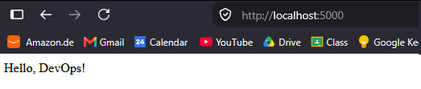
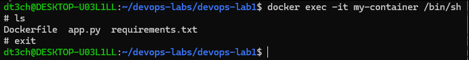

# DevOps Lab 1 — Dockerized Flask App

## Files

- `Dockerfile`
- `app.py`
- `requirements.txt`

## Dockerfile

```
FROM python:3.9-slim

WORKDIR /app

COPY requirements.txt .
RUN pip install -r requirements.txt

COPY . .

EXPOSE 5000

CMD ["python", "app.py"]
```

## Build

```
docker build -t my-app .
```

## Run

```
docker run -d -p 5000:5000 --name my-container my-app
```

## Verify

- App: <http://localhost:5000>
- Enter container: `docker exec -it my-container /bin/sh`

## Screenshots




# DevOps Lab 2 — Volumes & Networks

Flask app (`my-container`) connects to Redis (`my-db`) by container name over a custom network (`my-network`), with a named volume (`my-volume`) for data and a bind mount for live code editing.

## Build

```
docker build -t my-image .
```

## Run

```
docker network create my-network
docker run -d --name my-db --network my-network -v my-volume:/data redis:alpine
docker run -d --name my-container --network my-network -p 5000:5000 -v ${PWD}:/app my-image
```

## Verify

- Network: open <http://localhost:5000> — the visits counter increments, proving `my-container` resolves `my-db` by name
- Persistence:
  ```
  docker exec -it my-db redis-cli GET visits
  docker rm -f my-db
  docker run -d --name my-db --network my-network -v my-volume:/data redis:alpine
  docker exec -it my-db redis-cli GET visits
  ```
  value should match — data survives container removal
- Live edit: change `app.py` on host, refresh the browser — no rebuild, no restart

