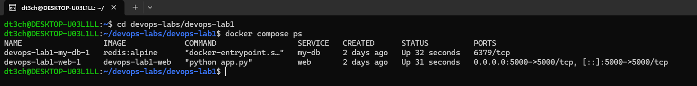
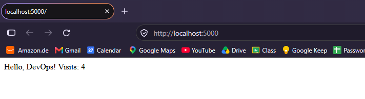

# DevOps Lab 3 — Docker Compose

Flask app (`web`) and Redis (`my-db`) described in one `docker-compose.yml`. The app connects to Redis by service name, with a named volume (`my-volume`) for data and a bind mount for live code editing.

## docker-compose.yml

```
services:
  my-db:
    image: redis:alpine
    volumes:
      - my-volume:/data

  web:
    build: .
    ports:
      - "5000:5000"
    volumes:
      - ./:/app
    depends_on:
      - my-db

volumes:
  my-volume:
```

## Run

```
docker compose up -d --build
docker compose ps
```

## Verify

- Network: open <http://localhost:5000> — the visits counter increments, proving `web` resolves `my-db` by service name
- Persistence:
```
  docker compose down
  docker compose up -d
```
  counter continues from the previous value — the volume survives `down`

## Screenshots


