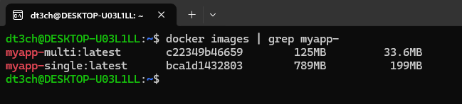

# DevOps Lab 3, Part 2 — Multi-stage build (PHP)

Same PHP app built two ways: single-stage (`Dockerfile.single`) and multi-stage (`Dockerfile.multi`), then compared by image size.

## Dockerfile.single

```
FROM php:8.3-cli

RUN apt-get update && apt-get install -y unzip

COPY --from=composer:2 /usr/bin/composer /usr/bin/composer

WORKDIR /app

COPY composer.json ./
RUN composer install --no-interaction

COPY . .

EXPOSE 8080

CMD ["php", "-S", "0.0.0.0:8080"]
```

## Dockerfile.multi

```
FROM php:8.3-cli AS builder

RUN apt-get update && apt-get install -y unzip

COPY --from=composer:2 /usr/bin/composer /usr/bin/composer

WORKDIR /app

COPY composer.json ./
RUN composer install --no-interaction

COPY . .


FROM php:8.3-fpm-alpine

WORKDIR /app

COPY --from=builder /app/vendor ./vendor
COPY --from=builder /app/index.php ./index.php
```

## Build

```
docker build -f Dockerfile.single -t myapp-single .
docker build -f Dockerfile.multi -t myapp-multi .
```

## Compare

```
docker images | grep myapp-
```



## Result

The image shrank from 789 MB to 125 MB, about 6 times. Composer, `unzip`, the apt cache, `composer.json` and the heavy Debian-based `php:8.3-cli` stayed in the `builder` stage and did not reach the final image. Only `vendor/` and `index.php` were copied into the lightweight `php:8.3-fpm-alpine`.
